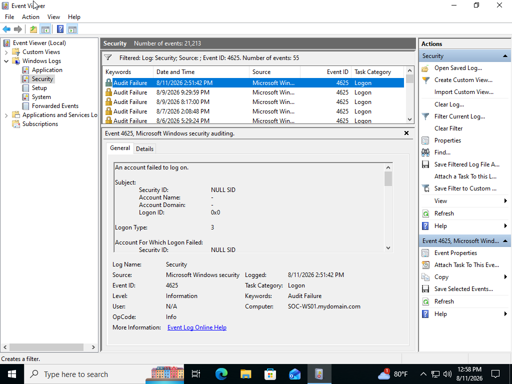
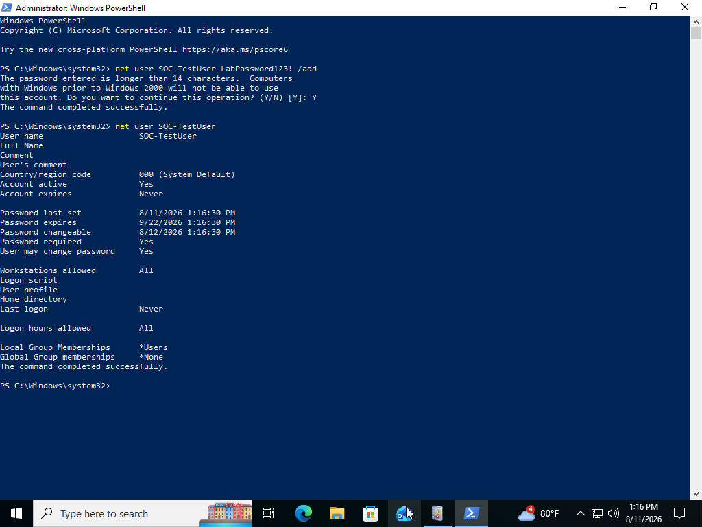
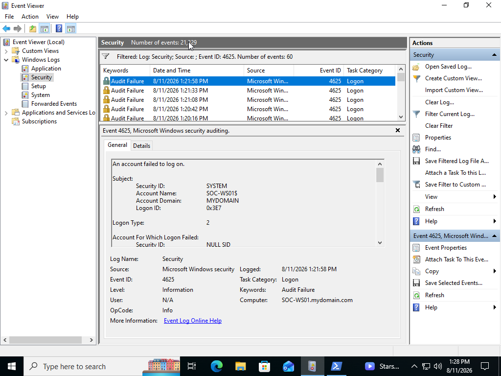
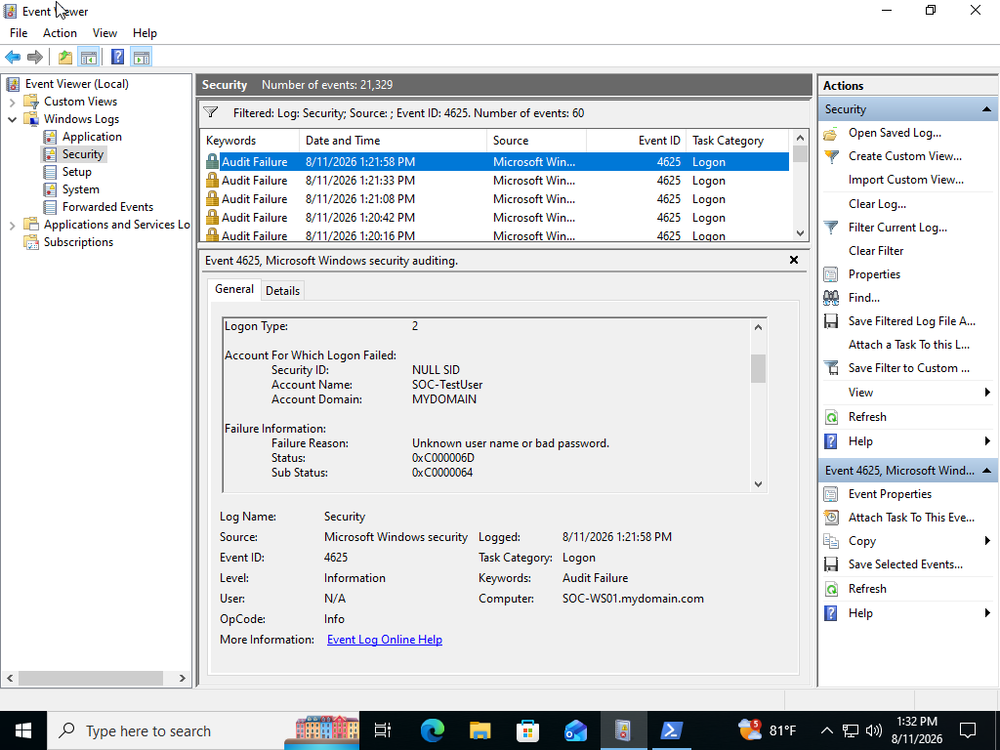
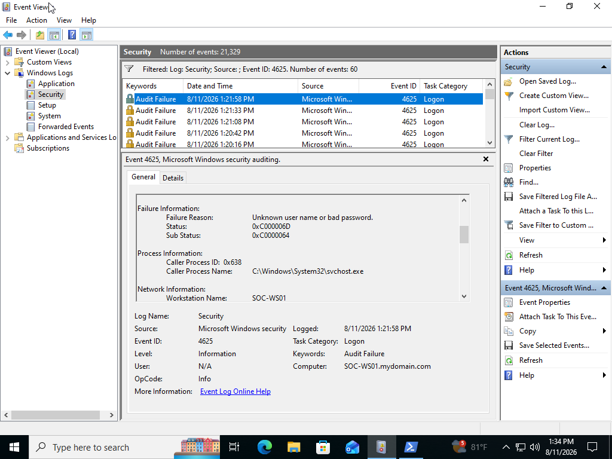
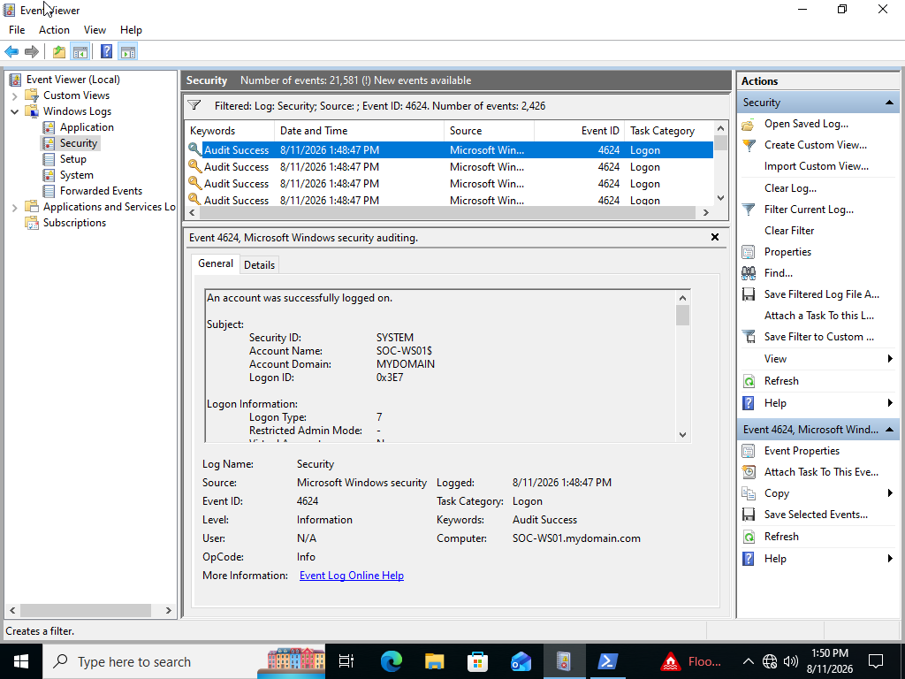
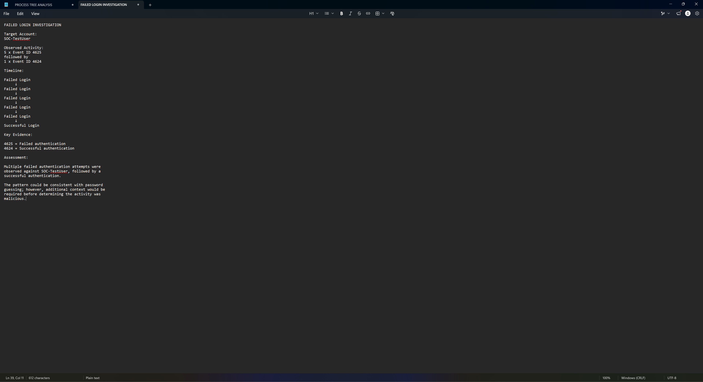

# SOC Analyst Lab #10 - Failed Login & Authentication Investigation

## Project Overview

This project demonstrates how repeated Windows authentication failures can be investigated using the Windows Security event log.

The lab focused on generating controlled failed authentication attempts, analyzing Windows Security Event ID 4625, identifying the targeted account and failure information, correlating the failures with a later successful authentication, and determining whether the resulting pattern could represent brute-force or password-guessing activity.

---

## Objectives

- Analyze Windows authentication logs
- Generate controlled failed authentication attempts
- Investigate Security Event ID 4625
- Analyze failure reasons and logon types
- Investigate Security Event ID 4624
- Correlate failed and successful authentication events
- Construct an authentication timeline
- Evaluate potential password-guessing behavior
- Document findings from a SOC analyst perspective

---

## Lab Environment

| Component | Details |
|---|---|
| Operating System | Windows 11 |
| Virtualization Platform | Oracle VirtualBox |
| Computer Name | SOC-WS01 |
| Primary Data Source | Windows Security Log |
| Investigation Tool | Windows Event Viewer |

---

## Investigation Scenario

Multiple failed authentication attempts were observed against a Windows user account.

As the SOC analyst, the objective was to determine:

- Which account was targeted
- How many authentication failures occurred
- Why authentication failed
- Which logon type was involved
- Whether source information was available
- Whether authentication eventually succeeded
- Whether the pattern warranted additional investigation or escalation

---

## Investigation Process

### Step 1 - Establish a Failed Login Baseline

Opened:

```text
Event Viewer
→ Windows Logs
→ Security
```

The Security log was filtered for:

```text
Event ID 4625
```

Event ID 4625 represents:

```text
An account failed to log on
```

Existing events were reviewed before generating the controlled test activity.

---

### Step 2 - Create a Test Account

A dedicated local account was created for the investigation:

```text
SOC-TestUser
```

Using a dedicated account allowed authentication activity to be generated without interfering with the normal lab account.

---

### Step 3 - Generate Failed Authentication Attempts

Multiple incorrect passwords were intentionally entered for `SOC-TestUser`.

These attempts generated a cluster of failed authentication events in the Windows Security log.

The activity was intentionally generated for educational and investigative purposes.

---

### Step 4 - Analyze Event ID 4625

The Security log was filtered for:

```text
4625
```

Relevant events were identified using the account name and timestamps.

The events provided information including:

- Account Name
- Account Domain
- Failure Reason
- Status
- Sub Status
- Logon Type
- Workstation information
- Source network information, when available

---

### Step 5 - Analyze Authentication Context

The Logon Type was reviewed to understand how Windows attempted to authenticate the account.

Windows supports multiple logon types, including:

| Logon Type | Description |
|---:|---|
| 2 | Interactive |
| 3 | Network |
| 4 | Batch |
| 5 | Service |
| 7 | Unlock |
| 8 | NetworkCleartext |
| 10 | RemoteInteractive |
| 11 | CachedInteractive |

The actual event data observed during the lab was used when assessing the authentication activity.

---

### Step 6 - Analyze the Failure Reason

The following fields were reviewed:

```text
Failure Reason
Status
Sub Status
```

These fields provide additional context for why an authentication attempt failed.

Understanding the failure reason helps distinguish between possibilities such as:

- Incorrect passwords
- Invalid usernames
- Disabled accounts
- Authentication restrictions
- Other credential-related failures

---

### Step 7 - Identify Successful Authentication

After the failed authentication activity, a successful login was intentionally performed using the test account.

The Security log was filtered for:

```text
Event ID 4624
```

Event ID 4624 represents:

```text
An account was successfully logged on
```

A corresponding event for `SOC-TestUser` was identified using the account name and timestamp.

---

## Key Windows Security Events

| Event ID | Description |
|---:|---|
| **4624** | Successful logon |
| **4625** | Failed logon |

These events can be correlated to reconstruct authentication activity surrounding a user account.

---

## Authentication Timeline

The investigation identified a pattern similar to:

```text
Failed authentication - Event ID 4625
            ↓
Failed authentication - Event ID 4625
            ↓
Failed authentication - Event ID 4625
            ↓
Additional authentication failures
            ↓
Successful authentication - Event ID 4624
```

The exact number of authentication failures was determined from the evidence generated during the lab.

---

## Investigation Findings

The investigation determined:

- Multiple failed authentication attempts occurred against `SOC-TestUser`.
- Windows recorded the failures using Security Event ID 4625.
- The events provided account, failure, and logon information.
- The authentication attempts occurred within a relatively short investigation window.
- A successful authentication was later recorded using Event ID 4624.
- The resulting pattern consisted of repeated failures followed by successful authentication.
- The activity was intentionally generated as part of the lab.
- No unauthorized access occurred.

---

## SOC Analyst Assessment

The observed authentication pattern was consistent with the intentionally generated lab activity.

Multiple Event ID 4625 authentication failures were recorded against the test account, followed by Event ID 4624 representing successful authentication.

In a real environment, repeated authentication failures followed by successful authentication could warrant additional investigation because the pattern may be consistent with password guessing.

However, the pattern alone does not prove malicious activity.

Possible legitimate explanations may include:

- A user repeatedly mistyping a password
- Stored credentials containing an outdated password
- Applications attempting to authenticate with old credentials
- Services using incorrect credentials
- Legitimate troubleshooting

Additional context would be required before determining whether escalation was necessary.

---

## Investigation Methodology

A useful workflow demonstrated during this lab was:

```text
Identify repeated authentication failures
            ↓
Determine targeted account
            ↓
Review timestamps
            ↓
Analyze failure reason
            ↓
Identify logon type
            ↓
Review source information
            ↓
Search for successful authentication
            ↓
Build authentication timeline
            ↓
Assess whether activity is expected
```

---

## Potential Indicators of Brute-Force Activity

Authentication activity may warrant additional investigation when observing:

- Large numbers of failed logins in a short period
- Repeated failures against the same account
- One source attempting authentication against many accounts
- Authentication from unusual systems or IP addresses
- Failures followed by successful authentication
- Authentication occurring at unusual times
- Privileged accounts being repeatedly targeted
- Logins inconsistent with normal user behavior

No single indicator automatically confirms a brute-force attack.

---

## Skills Demonstrated

- Windows authentication analysis
- Windows Security logs
- Event Viewer
- Security Event ID 4625
- Security Event ID 4624
- Failed login investigation
- Successful login correlation
- Authentication timeline reconstruction
- Brute-force awareness
- SOC alert triage concepts
- Security documentation

---

## Lessons Learned

This lab demonstrated how Windows authentication activity can be reconstructed using Security Event IDs 4625 and 4624.

Repeated failed logins can provide an important security signal, but determining whether they represent malicious password guessing requires additional context.

Correlating authentication failures with subsequent successful logins, logon types, timestamps, account information, and source information provides a stronger basis for determining whether activity should be escalated.

The lab also reinforced the importance of documenting what the evidence actually shows rather than assuming that repeated authentication failures automatically represent an attack.

---

## Screenshots

### Failed Login Baseline



---

### Test User Creation



---

### Failed Login Simulation


---

### Event ID 4625 - Failed Login



---

### Failed Login Details



---

### Authentication Failure Analysis



---

### Event ID 4624 - Successful Login



---

### Authentication Investigation Summary



---

## Conclusion

This project demonstrated how repeated Windows authentication failures can be investigated and correlated with successful authentication events.

By analyzing Security Event IDs 4625 and 4624, I reconstructed an authentication timeline, examined failure information and logon context, and evaluated whether the observed pattern could indicate password-guessing activity.

These skills provide a foundation for future SIEM alert investigations, authentication threat hunting, Microsoft Sentinel, and KQL analysis.
